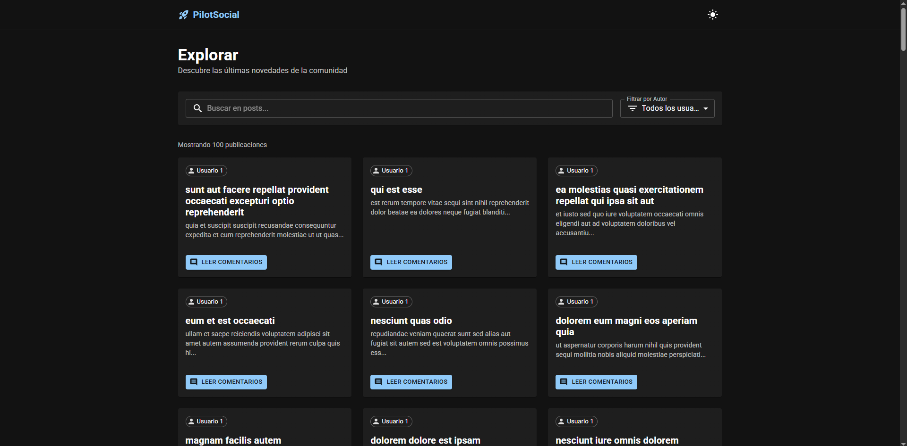
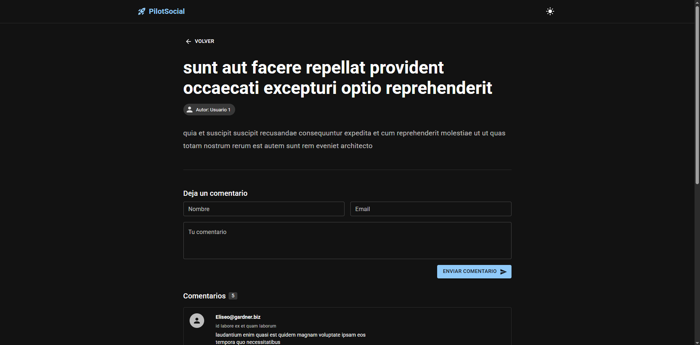

# PilotSocial - PilotX Frontend Challenge

Solución técnica para el desafío Frontend de PilotX. Una aplicación desarrollada con **React y TypeScript** centrada en la lectura fluida de contenido y la interacción mediante comentarios, implementando una arquitectura escalable y patrones de UX modernos.

<div align="center">

[](https://pilot-social.vercel.app/)

</div>

## 📋 Descripción del Proyecto

La aplicación permite a los usuarios navegar un feed de noticias, filtrar contenido de manera dinámica e interactuar en las discusiones. Se ha puesto especial énfasis en la **persistencia de datos del lado del cliente** para ofrecer una experiencia realista sobre una API de prueba.

### 📸 Galería
<div align="center">
  
  
</div>

### Funcionalidades Clave
1.  **Feed Inteligente:** Visualización de posts con filtros por **Autor** y **Búsqueda por texto** en tiempo real.
2.  **Sistema de Comentarios Híbrido:**
    * Consumo de comentarios existentes desde la API.
    * **Persistencia Local:** Los nuevos comentarios creados por el usuario se guardan en el navegador (`LocalStorage`) y se fusionan con los datos del servidor, evitando que desaparezcan al recargar.
3.  **Experiencia de Usuario (UX):**
    * Feedback visual inmediato (Loading Skeletons, Validaciones).
    * **Dark Mode / Light Mode** con persistencia de preferencia.
    * Diseño responsivo basado en Material Design.

## 🚀 Stack Tecnológico

Selección de herramientas basada en robustez, mantenibilidad y los criterios de evaluación:

### Core
  

### UI & UX
 

### Estado & Datos
 

### Routing & Formularios
  

## 📂 Estructura del Proyecto

El proyecto utiliza una arquitectura basada en **Features** (Vertical Slicing) para mejorar la escalabilidad:

```text
src/
├── api/          # Configuración de cliente HTTP (Axios)
├── components/   # Componentes UI reutilizables (UI Kit & Layouts)
├── features/     # Módulos funcionales encapsulados
│   ├── feed/     # Lógica, componentes y hooks del Feed principal
│   └── post/     # Lógica, componentes y hooks del Detalle y Comentarios
├── pages/        # Composición de vistas (Entry points de rutas)
├── routes/       # Definición de rutas y navegación
├── theme/        # Configuración del sistema de diseño (MUI Theme)
└── utils/        # Funciones auxiliares y constantes
```

## 📖 Metodología y Documentación

El desarrollo fue guiado por una fase inicial de análisis y diseño para asegurar el cumplimiento de los requerimientos desde la perspectiva del usuario.

* [📄 User Stories](./docs/USER_STORIES.md): Definición de los requerimientos funcionales y valor para el usuario.
* [📄 BDD Scenarios](./docs/SCENARIOS.md): Criterios de aceptación y casos de prueba en formato Gherkin (Given/When/Then).

## 🛠️ Instalación y Ejecución

1.  **Clonar el repositorio**
    ```bash
    git clone https://github.com/lautarocristiani/pilot-social.git
    cd pilot-social
    ```

2.  **Instalar dependencias**
    ```bash
    npm install
    ```

3.  **Iniciar servidor de desarrollo**
    ```bash
    npm run dev
    ```

## ✅ Cumplimiento de Requerimientos

- [x] **Implementación en ReactJS** (Vite + TS).
- [x] **Componentes Funcionales** (Hooks).
- [x] **Al menos 2 páginas** (Feed y Detalle).
- [x] **Manejo de Errores:** Implementado en las peticiones de API y validaciones de formulario.
- [x] **Tipado:** TypeScript estricto en toda la aplicación.